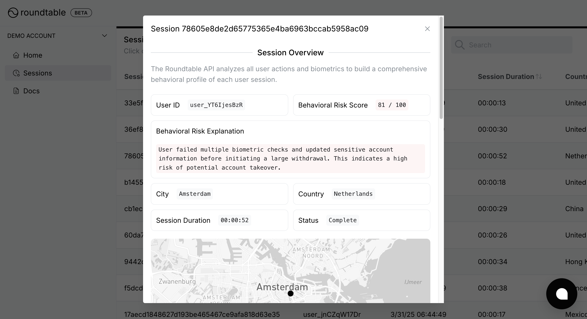

The [Roundtable Dashboard](https://accounts.roundtable.ai) provides a central location to view all session data, investigate individual user sessions, and manage your Roundtable account settings.

## Overview

After logging in, you’ll land on the `Home` page, which summarizes your overall API usage. This high-level snapshot makes it easy to track adoption and spot trends, such as a sudden spike in suspicious sessions.

## Viewing session data

Click on `Sessions` in the left-hand navigation bar to see a table of all recorded sessions. By default, this table lists:

- **Session ID** – The unique identifier automatically generated by Roundtable  
- **User ID** – The user identifier you provided (if any)  
- **Risk Score** – The numerical risk score (0-100) generated by Roundtable
- **Risk Explanation** – A brief description of why the risk score assigned to the session
- **Session Duration** – How long the session lasted
- **City Duration** –  The user's city (inferred from their IP address)  
- **Country** – The user’s country (inferred from their IP address)  
- **Status** – Live or Complete, depending on whether there was any user activity within the last 30 minutes

### Viewing session details

Click on any session row to open a Session Overview modal. Here, you can view the risk scores, risk explanation, complete user action log, and biometric checks.

## Demo workspace

If you want to see Roundtable in action before fully integrating, switch to the **Demo workspace** on the left-hand account dropdown menu. This workspace is pre-populated with example sessions so you can explore the full feature set before setting up your production environment.