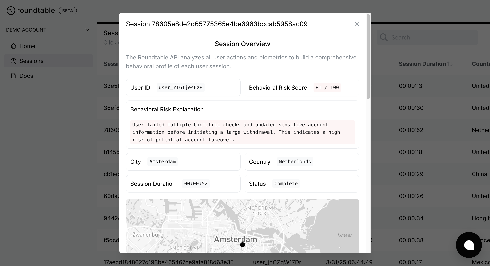

The [Dashboard](https://accounts.roundtable.ai) provides a central location to view all session data, investigate individual user sessions, and manage your Roundtable account settings.

## Viewing session data

Click on `Sessions` in the left-hand navigation bar to see a table of all recorded sessions. By default, this table lists:

- **Session ID** – The unique identifier automatically generated by Roundtable Proof-of-Human
- **User ID** – The user identifier you provided (if any)  
- **Risk Score** – The numerical risk score (0-100) generated by Roundtable Proof-of-Human
- **Risk Explanation** – A brief description of why the risk score assigned to the session
- **Session Duration** – How long the session lasted
- **City** –  The user's city (inferred from their IP address)  
- **Country** – The user’s country (inferred from their IP address)  
- **Status** – Live or Complete, depending on whether there was any user activity within the last 30 minutes

Biometric checks
- **Agent behavior** – An ML model detected patterns across biometric data consistent with automated behavior. The ML model only runs on Desktop sessions (Windows, macOS, Linux).
- **Programmatic typing** – The user enters text in an extremely consistent way, consistent with programmatic entry
- **Teleporting mouse** – The user's cursor jumps large distances with no intermediate movement
- **No corrections** – A large amount of text is entered without any backspaces or correction events
- **All pasted** – All text is pasted or entered all-at-once
- **Jump scrolling** – The user scrolls in large jumps with no intermediate or continuous scroll events
- **Centered clicks** – User made perfectly centered clicks with no natural variation
- **Programmatic clicking** – User clicks were made programmatically rather than through natural user interaction
- **External input** – User left the survey tab and pasted input after returning

Device checks
- **Bot** – The browser fingerprint matches known automation frameworks such as Selenium and Playwright
- **Virtual machine** – Signals suggest the browser is running in a remote, virtualized, sandboxed, or software-rendered environment
- **Software renderer** – The browser is using a software-based graphics renderer (e.g. SwiftShader or llvmpipe) instead of hardware acceleration, which may suggest a remote, virtualized, or headless browser environment
- **VPN** – The user's IP address belongs to a commercial VPN or hosting provider
- **TOR** – The user's connection is routed through a Tor exit node
- **Location spoofing** – The user's browser-reported GPS coordinates conflict with the IP-inferred location

### Viewing session details

Click on any session row to open a Session Overview modal. Here, you can view the risk scores, risk explanation, complete user action log, and biometric and device checks.

## Demo workspace

If you want to see Roundtable Proof-of-Human in action before fully integrating, switch to the **Demo workspace** on the left-hand account dropdown menu. This workspace is pre-populated with example sessions so you can explore the full feature set before setting up your production environment.